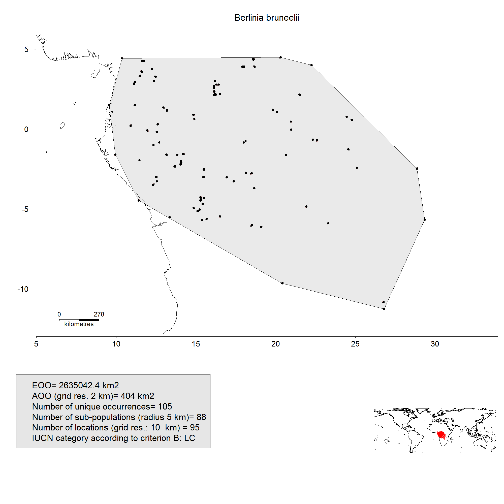
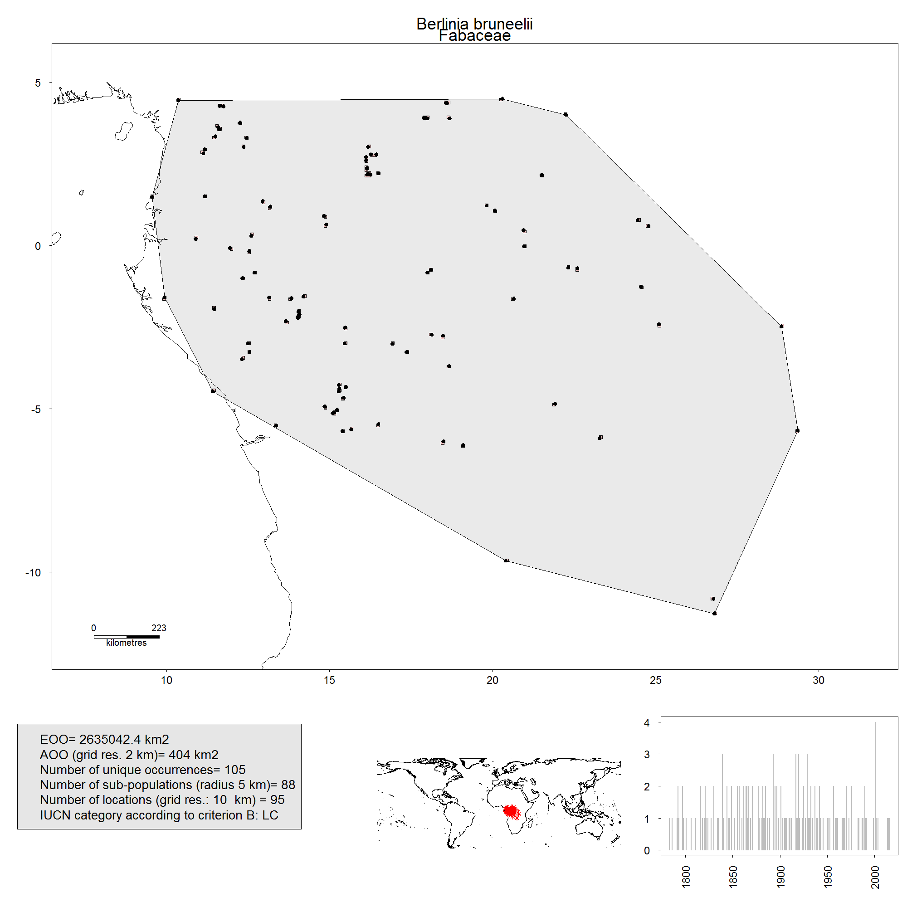
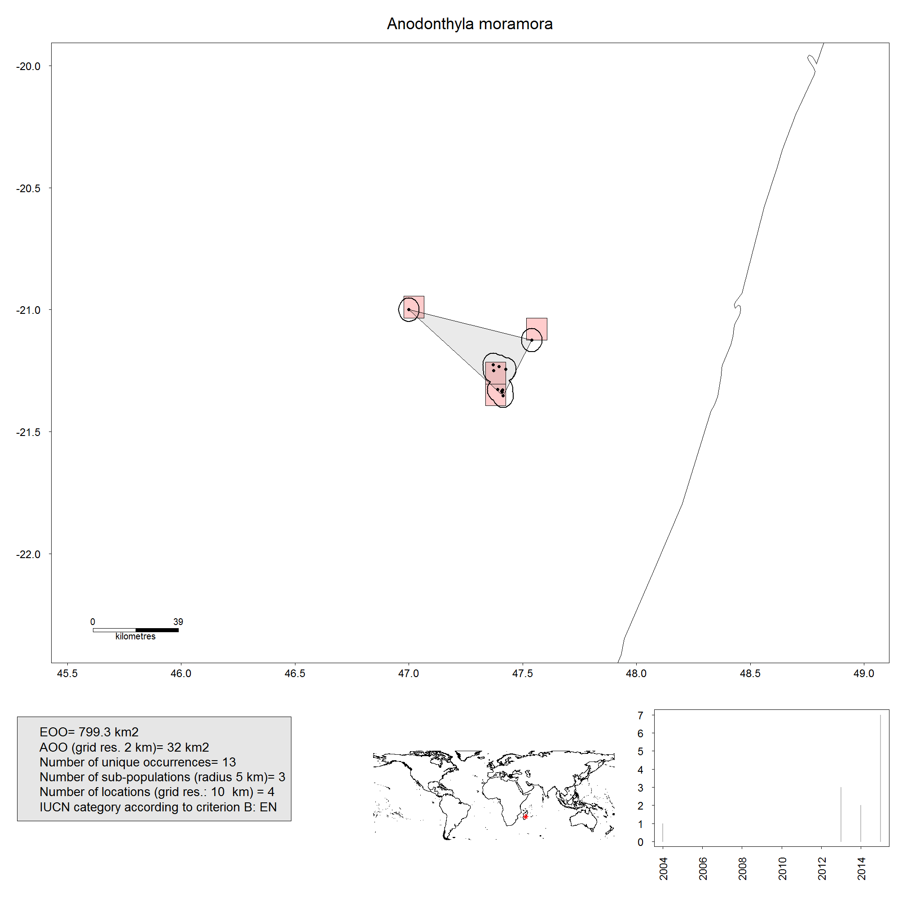
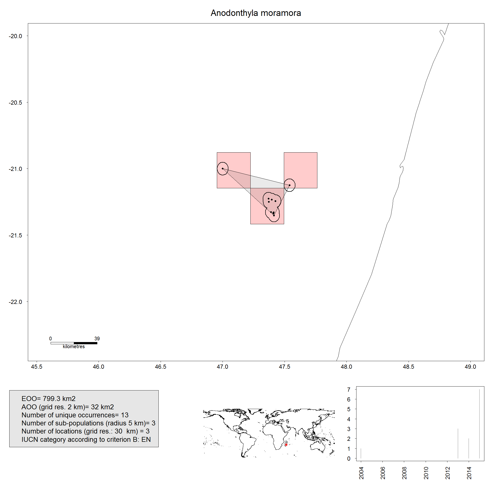
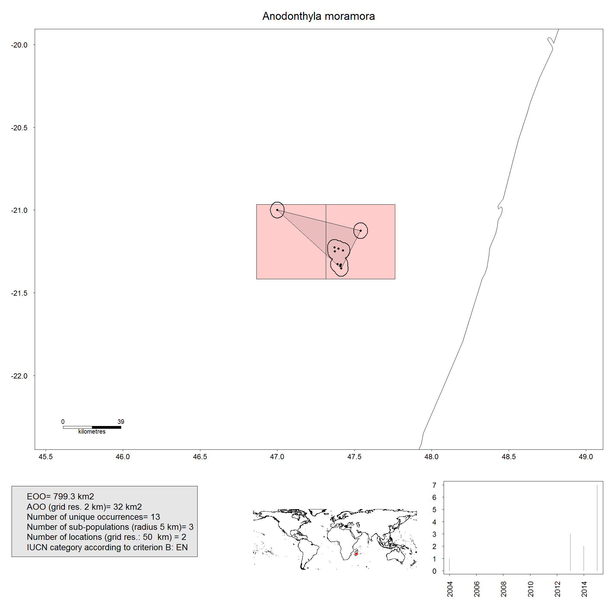
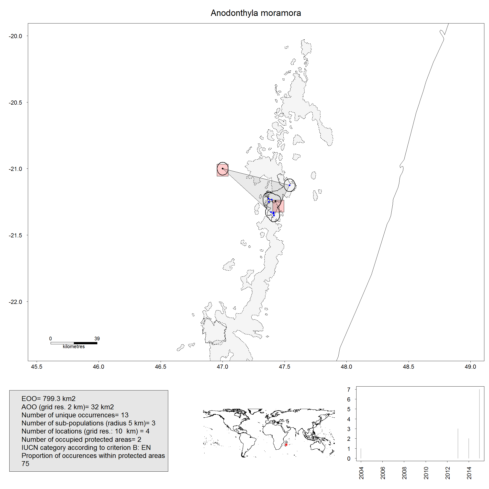
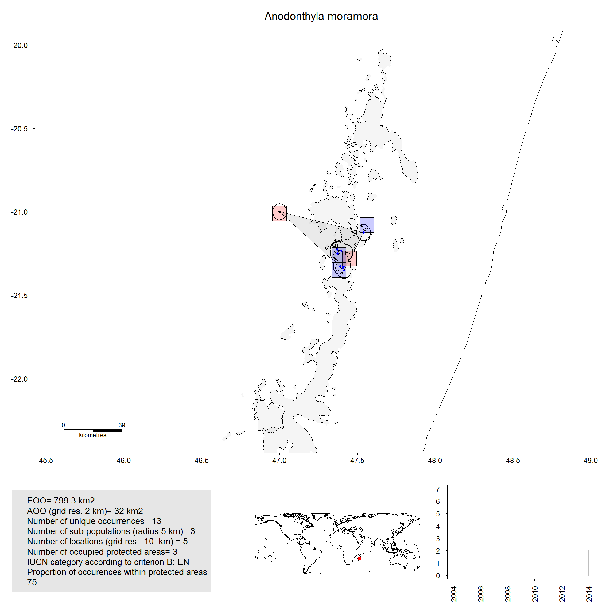
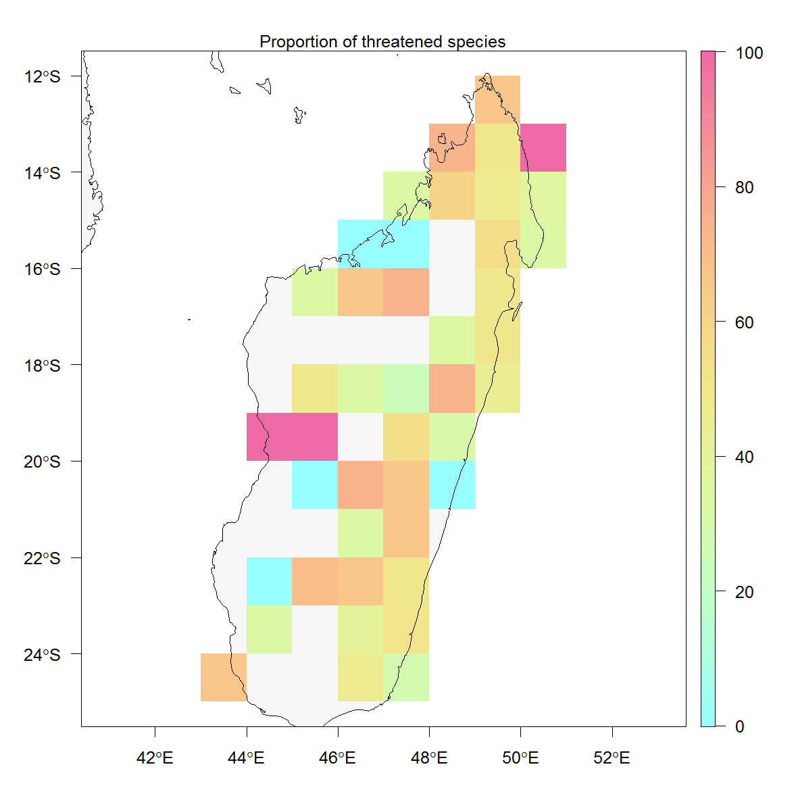
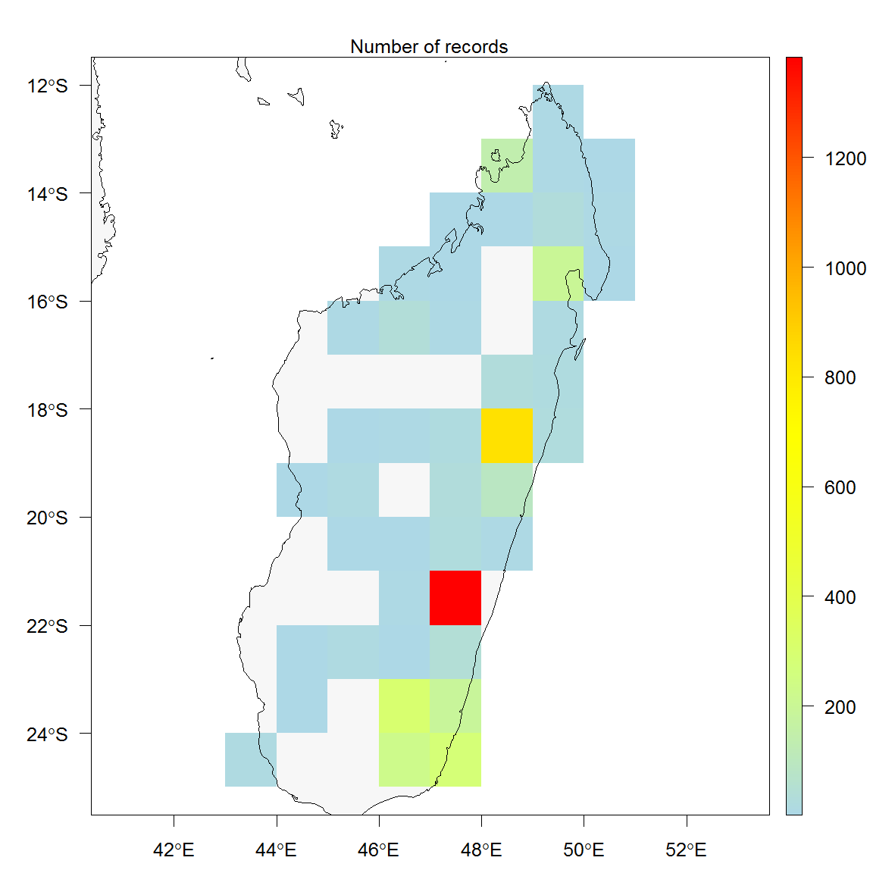
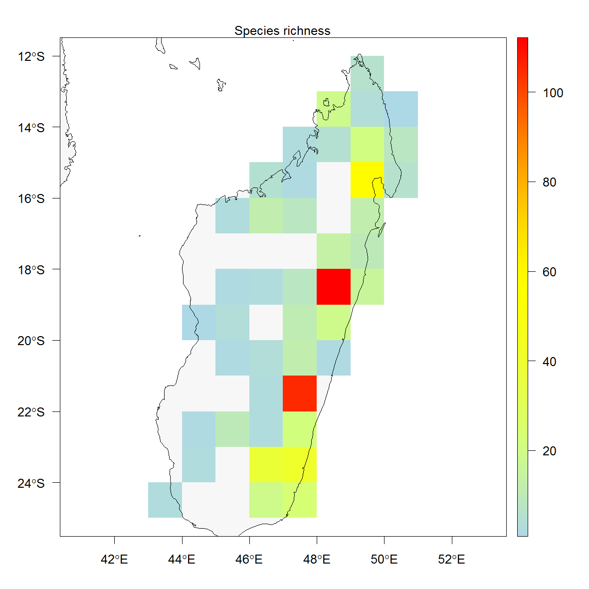

# Install R, ConR and dependent packages

**First step**. Install [R](https://cran.r-project.org/).

**Second step**. A proper way to work with R is to define a working directory. I advise to create a directory near the root (easier to handle), for example, here, named *Your_R_directory*
Now you can set your working directory by the following code:
```
setwd("C:/Your_R_directory/"")
```

**Third step**. Install ConR package (one of the two following) :

To install the version on CRAN
```
install.packages("ConR")
```

To install the version under development.
```
install.packages("devtools")
devtools::install_github("gdauby/ConR")
```

Note that the above procedures should be done only once, except the code for setting the working directory (second step).


# Attaching (loading) ConR


**Attach ConR package**
This should be done everytime you open R.
```
library(ConR)
```
```{r loadData,include=FALSE}
library(ConR)
data(dataset.ex)
MyData <- dataset.ex
MyData <- MyData[which(!MyData[,3] %in% c("species_1", "species_2")),]
MyData$tax <- as.character(MyData$tax)
```

**Help files**
Any function in R is documented by a help file which can be obtained by the following code for the four functions available in ConR:
```
?EOO.computing
?IUCN.eval
?map.res
?subpop.comp
```

*****
*****
# Computing EOO using `EOO.computing` function

The Extent of Occurrence (EOO) is

> the area contained within the shortest continuous imaginary boundary which can be drawn to encompass all the known, inferred or projected sites of present occurrence of a taxon, excluding cases of vagrancy [1] (IUCN 2012)


## Input file
You can prepare an excel file with three different columns:

```{r TableData,include=TRUE, echo=FALSE}
knitr::kable(head(MyData))
```

1.  ddlat: Latitude in decimal degrees
1.  ddlon: Longitude in decimal degrees
1.  Name of taxa

***Note 1*: field names do not matter but field order like above is mandatory**

***Note 2*: missing coordinates will be automatically skipped**

***Note 3*: example files are included in the package, you can have access to these files by using the following codes**.


For a six plant species example dataset:
```
data(dataset.ex)
head(dataset.ex)
?dataset.ex ## if you want to have information on this dataset
```
The following dataset include occurrences of Malagasy amphibian:
```
data(Malagasy.amphibian)
head(Malagasy.amphibian)
?Malagasy.amphibian ## if you want to have information on this dataset
```


You can import your input file by using the following code.
This will register your input file as an object you may name *MyData*, as below:
```
MyData <- read.csv("MyInput.csv")
```
Depending on the parameters defined in your computer, the separator in csv file may be comma or semi-colon.
If you note the importing process does not order correctly the fields of your input file, try to modifiy the separator used by the argument ```sep```, see below an example defining a comma as a separator:
```
MyData <- read.csv("MyInput.csv", sep=",")
```


You can have a glimpse of the first rows of your input file by running the following code:
```{r include=TRUE}
head(MyData)
```


Now you can run `EOO.computing` function on your input data by the following code:
```
EOO.computing(MyData)
```
The following information will appear in the console
```{r include=TRUE, echo = FALSE}
EOO.computing(MyData)
```
You can see that in this example, the input file contained occurrences for four species.

By default, a csv file is created in your working directory *Your_R_directory*. This csv file is named by default *EOO.results.csv*.

You can modify the name of the exported file using the following code line (for this example by the name *MyResults*) :
```
EOO.computing(MyData, file.name = "MyResults")
```


---------------------------------------

## Exporting shapefiles used to estimate EOO

It is possible to export in R the spatial polygon object used for estimating the EOO. This is done by using the argument `export_shp` which is a logical argument. A logical argument can take only two values: `TRUE` and `FALSE`.
By default, this argument is specified as `FALSE`. Hence, if you want to get these spatial polygons, you have specify it using the following code:
```{r include=TRUE, echo = TRUE}
EOO.computing(MyData, export_shp = T)
```
You can see that the output of the function now includes, in addition to the EOO values, objects of class `SpatialPolygons`.

It is possible to extract and map these objects by using the code below.

First, store your results into the object here named `EOO.results`:
```
EOO.results <- EOO.computing(MyData, export_shp = T)
```
```{r include=FALSE, echo = FALSE}
EOO.results <- EOO.computing(MyData, export_shp = T)
```

Then, for the first species (mapped in grey color):

```{r include=TRUE, echo = TRUE, dev.args=list(pointsize=2)}
plot(EOO.results$spatial.polygon_1, col="grey")
```

You can add a **background** showing the land cover. ConR include a shape file of land cover representing a default world land map, which can be loaded by running the following code (to be done only once during your working session, it attachs the object land in the R environment:
```{r include=TRUE, echo = TRUE, dev.args=list(pointsize=2)}
data(land)
```

Now you can add the land cover as a background by running the following code:
```{r include=TRUE, echo = TRUE, dev.args=list(pointsize=2)}
plot(EOO.results$spatial.polygon_1, col="grey")
plot(land, add=T)
```

For mapping the convex hull of the second species (mapped in red)

```{r include=TRUE, echo = TRUE, dev.args=list(pointsize=2)}
plot(EOO.results$spatial.polygon_2, col="red")
plot(land, add=T)
```


  You may want to **use your own land cover background shapefile**.
This is easily done by using the function [```readOGR```](https://www.rdocumentation.org/packages/rgdal/versions/1.4-8/topics/readOGR).

For using this function, you first has to install (if not yet installed) and load the package 
[rgdal](https://CRAN.R-project.org/package=rgdal).

`install.packages("rgdal")`
`library(rgdal)`

For example, for importing a shapefile named *MyShapefile*, just run the code (after transferring your file into *Your_R_directory*) :
`readOGR("MyShapefile.shp")`

---------------------------------------

## Writing shapefiles used to estimate EOO

The above manipulation allows you to extract in R the spatial polygons. It is also possible to create and export these spatial polygons as shapefiles into your working directory, which can later be imported in a GIS software. 
This is done by using the logical argument  `write_shp` which is FALSE by default. If you define it as TRUE as below, a directory named *shapesIUCN* is created in your working directory and will contain all the shapefiles created for computing EOO.

```
EOO.computing(MyData, write_shp = T)
```

---------------------------------------

## Cropping spatial polygon for excluding unsuitable area

  You may want to exclude areas that are not suitable for your species when computing EOO. This is feasible using the logical argument `exclude.area` which is FALSE by default. When define as TRUE, cropped areas will be defined by the shapefile you provide with the argument `country_map`. Note that it is mandatory to provide a shapefile for `country_map` if `exclude.area` is TRUE.
  In the example, below, we provide the `land` world cover. Ocean cover is therefore excluded when computing EOO.
```{r include=TRUE, echo = TRUE}
EOO.computing(MyData, exclude.area = T, country_map = land)
```

Results of the EOO are higher for species that have an overlapping hull convex with the ocean cover:
```{r include=TRUE, echo = TRUE}
EOO.computing(MyData, exclude.area = F, country_map = land)
```

The result can be visually verified by mapping the spatial polygon:
```{r include=TRUE, echo = TRUE, dev.args=list(pointsize=4)}
EOO.results <- EOO.computing(MyData, exclude.area = T, country_map = land, export_shp = T)
plot(EOO.results$spatial.polygon_2, col="red")
plot(land, add=T)
```

---------------------------------------

## Using an alpha hull to compute EOO
  By default, EOO is based on a convex hull. You may want to use instead an [alpha hull](https://CRAN.R-project.org/package=alphahull) (see [2] for guidelines on when it is relevant). This is feasible by using the argument `method.range` as follows:
```{r include=TRUE, echo = TRUE}
EOO.computing(MyData, method.range = "alpha.hull")
```

To visually map the result:
```{r include=TRUE, echo = TRUE, dev.args=list(pointsize=2)}
EOO.results <- EOO.computing(MyData, method.range = "alpha.hull", export_shp = T)
plot(EOO.results$spatial.polygon_1, col="red")
plot(land, add=T)
```

The alpha parameter of the alpha-hull can be modified by the `alpha` argument.
Below an example with the second species:
```{r include=TRUE, echo = TRUE, dev.args=list(pointsize=2)}
EOO.results <- EOO.computing(MyData, method.range = "alpha.hull", export_shp = T, alpha=5)
plot(EOO.results$spatial.polygon_1, col="red")
plot(land, add=T)
```

Alpha hull can be equally cropped for unsuitable area:
```{r include=TRUE, echo = TRUE, dev.args=list(pointsize=2)}
EOO.results <- EOO.computing(MyData, method.range = "alpha.hull", export_shp = T, alpha=5, exclude.area = T, country_map = land)
plot(EOO.results$spatial.polygon_1, col="red")
plot(land, add=T)
```
  
---------------------------------------

## Warning messages

  The EOO is null when occurrences form a straight segment. This is a very infrequent case and obviously represents an underestimate of the EOO [2] (IUCN 2016). In that specific case, there is a warning and the EOO will be estimated using a different method: a polygon is built by adding a buffer of a defined size to the segment.  
The buffer is by default equal to 0.1 and is defined by the argument `buff.alpha`.

```{r include=FALSE}
MyData <- dataset.ex
MyData <- MyData[which(MyData[,3] %in% c("species_2")),]
```

As an illustration, see this example below with an hypothetical species of three occurrences
```{r include=TRUE, echo = TRUE, dev.args=list(pointsize=2)}
EOO.results <- EOO.computing(MyData, export_shp = T)
plot(EOO.results$spatial.polygon_1, col="red")
points(MyData[,2], MyData[,1], pch=19) ### map the occurrences.
```


The EOO cannot be computed when there is less than three unique occurrences [^1]. When this is the case, a warning message appears.
```{r include=FALSE}
MyData <- dataset.ex
MyData <- MyData[which(MyData[,3] %in% c("species_1")),]
```

See this example below with a hypothetical species having less than three occurrences
```{r include=TRUE, echo = TRUE, dev.args=list(pointsize=5)}
EOO.results <- EOO.computing(MyData, export_shp = T)
EOO.results
```

*****
*****
# Subpopulations computation using `subpop.comp` function

## Input data

See 1.3.1.

## Using `subpop.comp` function

This function applies the method called **circular buffer method** for estimating the number of subpopulation (Rivers *et al.*, 2010).

```{r include=FALSE}
data(dataset.ex)
MyData <- dataset.ex
```

The argument `Resol_sub_pop` must be given and defines in kilometres the radius of the circles around each occurrence.
```{r include=TRUE, echo = TRUE, dev.args=list(pointsize=5)}
SUB <- subpop.comp(MyData, Resol_sub_pop=30)
SUB
plot(SUB[["Platycoryne guingangae"]][["subpop.poly"]], col="red")
plot(land, add=TRUE)
```

*****
*****
# Preliminary IUCN assessment for multiple species using `IUCN.eval` function

## Input data

You can prepare an excel file with three mandatory different columns and two optional ones:

```{r include=FALSE}
data(dataset.ex)
MyData <- dataset.ex
```

```{r include=TRUE, echo=FALSE}
knitr::kable(head(MyData))
```

1.  ddlat: Latitude in decimal degrees
1.  ddlon: Longitude in decimal degrees
1.  Name of taxa

* ***Note 1*: for these three fields, names do not matter but field position (latitude, longitude and taxa names in that order) are mandatory**

* ***Note 2*: missing coordinates will be automatically skipped**

1.  (optional) *higher.tax.rank* : name of higher taxonomic rank that will be display in output maps (see below).
1.  (optional) *coly* : year of sample collection. If provided, a graph will be added in output maps (see below).

* ***Note 3*: for these former two optional fields, names matter and should be *higher.tax.rank* and *coly* **


```{r include=FALSE, echo=FALSE}
MyData2 <- MyData
MyData2 <- MyData2[order(MyData2[,3]),]
head(MyData2)
MyData2 <- cbind(MyData2, c(rep("Fabaceae", table(dataset.ex[,3])[1]), 
                            rep("Arecaceae", table(dataset.ex[,3])[2]), 
                            rep("Orchidaceae", table(dataset.ex[,3])[3]), 
                            rep("Rubiaceae", table(dataset.ex[,3])[4]),
                            rep("Familiaceae", table(dataset.ex[,3])[5]), 
                            rep("Familiaceae", table(dataset.ex[,3])[6])))
colnames(MyData2)[4] <- "higher.tax.rank"
MyData2 <- cbind(MyData2, sample(1780:2016, nrow(MyData2), replace = T))
colnames(MyData2)[5] <- "coly"
head(MyData2)
rownames(MyData2) <- rownames(MyData)
```


|    ddlat|   ddlon|tax                |higher.tax.rank | coly|
|--------:|-------:|:------------------|:---------------|----:|
| -4.46667| 11.4167|Berlinia bruneelii |Fabaceae        | 1827|
| -5.66667| 29.3500|Berlinia bruneelii |Fabaceae        | 1989|
|  3.88333| 18.6833|Berlinia bruneelii |Fabaceae        | 1980|
|  4.48333| 20.3000|Berlinia bruneelii |Fabaceae        | 1805|
| -2.76667| 18.4833|Berlinia bruneelii |Fabaceae        | 1788|
| -1.26667| 24.5500|Berlinia bruneelii |Fabaceae        | 1993|


You can import your input file by using the following code.
This will register your input file as an object you may name *MyData*, as below:
```
MyData <- read.csv("MyInput.csv")
```

You can have a glimpse of the first rows of your input file by running the following code:
```{r include=TRUE}
head(MyData)
```

```{r include=TRUE}
head(MyData2)
```

## Running `IUCN.eval` function by default

To see what are the default values, see `?IUCN.eval`

You can simply run the following code:

```{r include=T, echo=TRUE}
IUCN.eval(MyData)
```
Because the EOO computation (using `EOO.computing`, see 1.3) is included within `IUCN.eval` function, we have the **same arguments** available (see 1.3) and the **same warnings** (see 1.3.6)

## Output: IUCN categories and parameters estimation

The output of the function is a data frame that provides several paramaters as well as the preliminary IUCN category.  

```{r include=FALSE, echo=TRUE}
MyResults <- IUCN.eval(MyData)
```


```{r include=TRUE, echo=FALSE}
head(MyResults)
```

Note that by default, an excel file has been created in your working directory *Your_R_directory*. 
If you prefer to have your output exported as csv file, you can do it by changing the argument *write_file_option*:
```
IUCN.eval(DATA = MyData, write_file_option = "csv")
```

```{r include=T, echo=FALSE}
knitr::kable(head(MyResults))
```

This excel file is named by default *IUCN_results.xlsx*
But you can change the file name using the following code:

```
MyResults <- IUCN.eval(MyData, file_name="MyIUCNresults")
```

The different fields of the output data frame are:  


**EOO** field: provides EOO in square kilometres.  

* if EOO is lower than AOO, EOO is put equal to AOO, as suggested by IUCN guidelines [2] (IUCN 2016).  

* NA is given when EOO cannot be computed because the taxon has less than three unique occurrences.


**AOO** field: provides AOO in square kilometres.  

**Nbe_unique_occ.** field: the number of unique coordinates.  

**Nbe_subPop** field: the number of subpopulations following the circular buffer method (Rivers *et al.* 2010) (see 1.4).  

* this parameter is not taken into account for the evaluation following Criterion B.  

**Nbe_loc** field: the number of locations (see 5.7)  

**Category_CriteriaB** field: IUCN category following conditions of Criterion B (see table below).  

* LC: Least Concern  

* NT: Near Threatened  

    + NT category is assigned here for taxa with a number of location lower than 14 and higher than 10, with EOO higher or equal to 20,000 km^2^ and with AOO higher or equal to 2,000 km^2^.

* VU: Vulnerable  

* EN: Endangered  

* CR: Critically Endangered  


***Subcriteria and conditions for determining the conservation status following IUCN criterion B (IUCN 2012). Only sub-criteria B1 and B2 and condition (a) (number of locations) are taken into account, while condition (b)(iii) is assumed to be true***


**Category_code** field: code indicating which sub-criteria or conditions (see table above) are met [2] (IUCN 2016).  

* for example *EN B2a* mean the category EN is preliminary assigned to this taxa because sub-criterion *B2* (AOO) is lower than 500 km² and higher than 10 km² and condition (a) (number of locations) is lower than 6 and higher than 1.  


**Category_AOO** field: IUCN category following conditions of Criterion B (see table above) but without taking into account sub-criterion B1 (EOO).  

**Category_EOO** field: IUCN category following conditions of Criterion B (see table above) but without taking into account sub-criterion B2 (AOO).  

## Output maps

By default, `IUCN.eval` creates for each taxa a map in png format. These maps are stored in a directory, named *IUCN__results_map* that has been created in your working directory *Your_R_directory*.




```{r include=F, echo=FALSE}
MyResults <- IUCN.eval(MyData2, file_name="MyIUCNresults")
```

If the optional fields *higher.tax.rank* and *coly* are provided, output maps display a bar graph showing the number of collection per year on the bottom right of the map and the name of the higher taxonomic rank below the taxon name.




```{r include=FALSE, echo=FALSE}
data(Malagasy.amphibian)
MyData <- Malagasy.amphibian[which(Malagasy.amphibian[,"tax"] %in% c("Anodonthyla moramora")),]
IUCN.eval(MyData, Cell_size_locations = 10)
```

```{r include=F, echo=F}
IUCN.eval(MyData, Cell_size_locations = 10, file_name = "loc1")
```

Another example of an output map for a narrow range malagasy amphibian species.

Circles around occurrence points represent subpopulations, as defined in **4.**

Pink squares represent occupied cells of the grid used for estimating the number of locations, see **5.7**

Finally, the polygon in grey is the hull convex used to estimate the EOO, see **3.**




## Options concerning the computation of area of occupancy (AOO)

The area of occupancy (AOO) is computed by calculating the area covered by the number of occupied cells of a grid for a given resolution. By default, the size of grid cells is 2 km, as recommanded by IUCN guidelines [2] (IUCN 2016).  
It is nevertheless possible to modify the resolution using the argument `Cell_size_AOO`, as follows:

```{r include=FALSE}
MyData <- dataset.ex
MyData <- MyData[which(MyData[,3] %in% c("Psychotria minuta")),]
```

Cell size of 20 km:
```{r include=TRUE, echo=TRUE}
MyResults <- IUCN.eval(MyData, Cell_size_AOO = 20)
MyResults
```
AOO is now equal to 4000 km².

**Important note:**

A grid may give different numbers of occupied cells (and thus different AOO values) depending on the position of the grid. The script currently tests different positions of the grid by several translations. When the number of occupied cells vary for the different positions, the minimum is chosen, as suggested by the guidelines of IUCN [2] (IUCN 2016).

## Options concerning the computation of extent of occurence (EOO)

See point  1.3.

## Options concerning the computation of number of location


A location is defined by the IUCN as

> a geographically or ecologically distinct area in which a single threatening event can rapidly affect all individuals of the taxon present. The size of the location depends on the area covered by the threatening event and may include part of one or many subpopulations. Where a taxon is affected by more than one threatening event, location should be defined by considering the most serious plausible threat [1] (IUCN 2012) [2] (IUCN 2016).

Given this definition, it is clear that the number of locations can only properly be assessed using a species by species procedure. We nevertheless propose a procedure in ConR that estimates the number of locations using the following method:  

The number of locations is the number of occupied cells of a grid for a given resolution. By default, the size of grid cells is 10 km.

It is also possible to take into account different levels of threat by including a map of protected areas (see below)

### Estimation of the number of locations by default 

It is possible to modify the resolution using the argument `Cell_size_locations`.  
Below is an example for amphibian species of Madagascar.


First, for the example, I select one species among the Malagasy amphibians example dataset included in the package loaded by using the `data()` function:
```{r include=TRUE}
data(Malagasy.amphibian)
MyData <- Malagasy.amphibian[which(Malagasy.amphibian[,"tax"] %in% c("Anodonthyla moramora")),]
```


Locations computed for a grid of 10 km cell size:
```{r include=T, echo=T}
IUCN.eval(MyData, Cell_size_locations = 10)
```
```{r include=F, echo=F}
IUCN.eval(MyData, Cell_size_locations = 10, file_name = "loc1")
```


Locations computed for a grid of 30 km cell size:
```{r include=T, echo=T}
IUCN.eval(MyData, Cell_size_locations = 30)
```
```{r include=F, echo=F}
IUCN.eval(MyData, Cell_size_locations = 30, file_name = "loc2")
```



Locations computed for a grid of 50 km cell size:
```{r include=T, echo=T}
IUCN.eval(MyData, Cell_size_locations = 50)
```
```{r include=F, echo=F}
IUCN.eval(MyData, Cell_size_locations = 50, file_name = "loc3")
```



The resolution of the grid can also be defined by a sliding scale (Rivers *et al.* 2010), that is, the cell size is defined by 1/x of the maximum inter-occurrences distance. In such case, the resolution of the grid is species-specific.  
This method can be implemented in IUCN.eval by using the arguments `method_locations` and `Rel_cell_size`.  
`Rel_cell_size` defines the *x*, where the cell size = 1/x*(maximum distance between two occurrences)

```{r include=F, echo=F}
IUCN.eval(MyData, method_locations = "sliding scale", Rel_cell_size = 0.05)
```

Below, an example, where the resolution is 5% of the maximum distance between two occurrences. The resulting resolution is 3.1 km as indicated in resulting map legend.
```{r include=F, echo=F}
IUCN.eval(MyData, method_locations = "sliding scale", Rel_cell_size = 0.05, file_name = "slide")
```


**Important note:**

A grid may give different numbers of occupied cells depending on the position of the grid. The script currently tests different positions of the grid by several translations. When the number of occupied cells varies for the different positions, the minimum value is chosen.


### Estimation of the number of locations by taking into account protected areas

In order to take into account different levels of threat, we propose a procedure to take into account protected areas. The rationale is that  occurrences within and outside protected areas are under different levels of threat. We propose two different methods using the `IUCN.eval` function.
The method can be specified by the argument `method_protected_area`:

* `method_protected_area = "no_more_than_one"`
This is the method implemented by default.
In that case, all occurrences within a given protected area are considered as one location. All sub-populations within a protected area are under a similar level of threat which could for example the degazettement of the protected area.  
Occurrences outside the protected area will be used for estimating the number of locations using an overlaying grid.

The example below illustrates this method:
```
data(Madagascar.protec)
IUCN.eval(MyData, Cell_size_locations = 10, protec.areas = Madagascar.protec)
```


```{r include=F, echo=F}
data(Madagascar.protec) # This code line load the Malagasy protected area shapefile included in ConR
IUCN.eval(MyData, Cell_size_locations = 10, file_name = "protec", protec.areas = Madagascar.protec)
```




The legend shows the results. 75% of occurrences are within protected areas. Two different protected areas are occupied, which represent two different locations. In addition, 25% of occurrences are outside protected areas. For these occurrences, the overlaid grid of 10 km leads to two occupied cells, which reprensents two different locations. Hence, the total number of location is estimated to be 4 for this species.


* `method_protected_area = "other"`
In that case, occurrences within and outside protected area are treated separately by the same procedure: overlaying of grid of a given resolution.
```
data(Madagascar.protec)
IUCN.eval(MyData, Cell_size_locations = 10, protec.areas = Madagascar.protec, method_protected_area = "other")
```
Contrary to the previous results, the number of locations within protected area is not equal to the number of occupied protected areas.

```{r include=F, echo=F}
data(Madagascar.protec)
IUCN.eval(MyData, Cell_size_locations = 10, file_name = "protec2", protec.areas = Madagascar.protec, method_protected_area = "other")
```



**Note 1:**
Only a map of protected areas from Madagascar is included in ConR, as an example dataset. If you want to import your own protected area shapefile, you can do it by using the function [```readShapePoly```](https://CRAN.R-project.org/package=maptools). Protected area shapefile can be freely dowloaded from the World Database on Protected Areas (WDPA, http://www.protectedplanet.net/).
For example, for importing a shapefile names *MyShapefile*, just run the code (after transferring your file into *Your_R_directory*) :
`readShapePoly("MyShapefile" , proj4string=CRS("+proj=longlat +datum=WGS84"))`.

**Note 2:**
The protected areas shapefile should be given as `SpatialPolygonsDataFrame` in the argument `protec.areas` as above. The argument `ID_shape_PA` should also be given and should represent the unique ID of each protected area in the provided shapefile. This can be checked by the following code:

`colnames(Madagascar.protec@data)` with the malagasy protected area shapefile.


*****
*****
# Compute in parallel

For large datasets (typically more than 100 species or when producing maps is required), I recommand to run the computation in parallel, which is feasible by using the following code.


```
data(Madagascar.protec)
IUCN.eval(MyData, Cell_size_locations = 10, protec.areas = Madagascar.protec, parallel=T, NbeCores=4)
```
   
The argument `NbeCores` indicate the number of cores on which you want to run the analysis.
For more information, see the package [doparallel](https://CRAN.R-project.org/package=doParallel).


*****
*****
# Mapping results of `IUCN.eval` using `map.res` function
If you assess the preliminary conservation status of large number of species in a given region, you can map the number of records, species, threatened species and the proportion of threatened species by using the `map.res` function.
Maps are drawn in fixed grid cells whose resolution and extent can be defined.


Below, preliminary conservation status of all malagasy amphibian species of the example dataset are assessed by using the `IUCN.eval` function. Results are stored in an object MyResults.

This computation should be relatively time consuming (depending on the computer power) given the number of species assessed, so be patient.
For a high number of species, parallelizing is a good option for fastening the computation.
```{r include=F, echo=F}
data(Madagascar.protec)
data(Malagasy.amphibian)
MyResults <- IUCN.eval(Malagasy.amphibian, protec.areas = Madagascar.protec, ID_shape_PA = "WDPA_PID", showWarnings = FALSE, DrawMap=FALSE, SubPop = FALSE, write_file_option="csv")
```

```
data(Madagascar.protec)
data(Malagasy.amphibian)
MyResults <- IUCN.eval(Malagasy.amphibian, protec.areas = Madagascar.protec, ID_shape_PA = "WDPA_PID", showWarnings = FALSE)
```

You can map the result by using the following code:
```
data(land)
map.res(MyResults, Occurrences=Malagasy.amphibian, country_map=land, export_map=TRUE, threshold=3, 
 	LatMin=-25,LatMax=-12,LongMin=42, LongMax=52, Resol=1)
```
The argument `Occurrences` should include the input file.

The argument `country_map` should include the background spatial polygon. In this case, we use the default `land` shapefile that should be loaded once before using `data()`.

The argument `export_map` is logical. If `TRUE`, maps are exported in your working environment.

The argument `Resol` must be numerical. It indicates the resolution of the grid cell.

The argument `threshold` must be numerical. It indicates the minimum number of occurrences within each grid cell: above, it is defined as 3. Hence, only grid cells with at least three occurrences are shown.

The arguments `LatMin`, `LatMax`, `LongMin` and `LongMax` are minimum/maximum latitude/longitude of the maps. If not given, the extent of the map is the extent of all occurrences.


```{r include=F, echo=F}
MyResults <- read.csv("IUCN_results.csv", row.names=1)
map.res(
  MyResults,
  Occurrences = Malagasy.amphibian,
  country_map = land,
  export_map = TRUE,
  threshold = 3,
  LatMin = -25,
  LatMax = -12,
  LongMin = 42,
  LongMax = 52,
  Resol = 1
)
```


Maps should have been created in your working directory.









```{r include=F, echo=F}
files <- list.files(paste(getwd(), "/MyIUCNresults_results_map/", sep=""), full.names = T)
file.remove(files[-grep("Berlinia_bruneelii", files)])
#files <- list.files(paste(getwd(), "/", sep=""), full.names = T)
#unlink(files[grep("Berlinia_bruneelii", files)])
```


[1]: http://www.iucnredlist.org/technical-documents/categories-and-criteria "IUCN. 2012b. IUCN Red List Categories and Criteria: Version 3.1. Second edition. Gland, Switzerland and Cambridge, UK: IUCN." 

[2]: http://www.iucnredlist.org/documents/RedListGuidelines.pdf  "IUCN Standards and Petitions Subcommittee. 2016. Guidelines for Using the IUCN Red List Categories and Criteria. Version 12. Prepared by the Standards and Petitions Subcommittee."
  

[^1]: See argument `method.less.than3` for an alternative by giving an arbitratry value to these species.

# References

  IUCN. 2012. IUCN Red List Categories and Criteria: Version 3.1. Second edition. Gland, Switzerland and Cambridge, UK: IUCN. http://www.iucnredlist.org/technical-documents/categories-and-criteria  
  
  IUCN Standards and Petitions Subcommittee. 2016. Guidelines for Using the IUCN Red List Categories and Criteria. Version 12. Prepared by the Standards and Petitions Subcommittee. http://www.iucnredlist.org/documents/RedListGuidelines.pdf  
  
  Rivers MC, Bachman SP, Meagher TR, Lughadha EN, Brummitt NA (2010) Subpopulations, locations and fragmentation: applying IUCN red list criteria to herbarium specimen data. Biodiversity and Conservation 19: 2071-2085. doi: 10.1007/s10531-010-9826-9  


